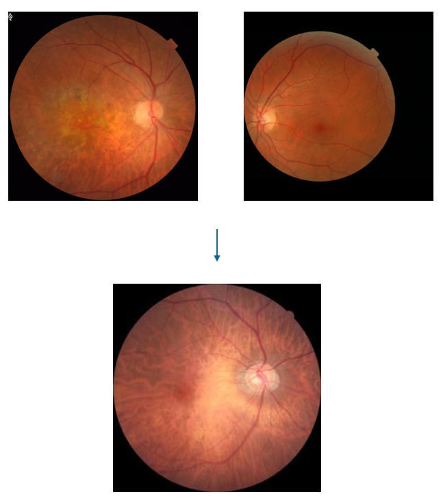
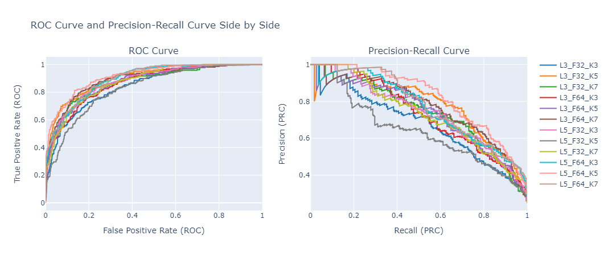
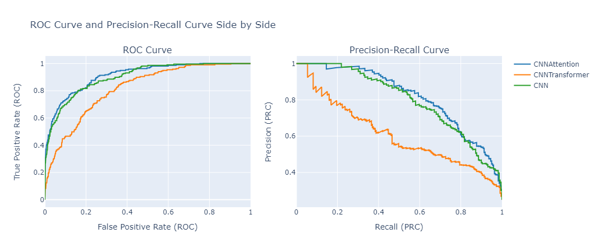
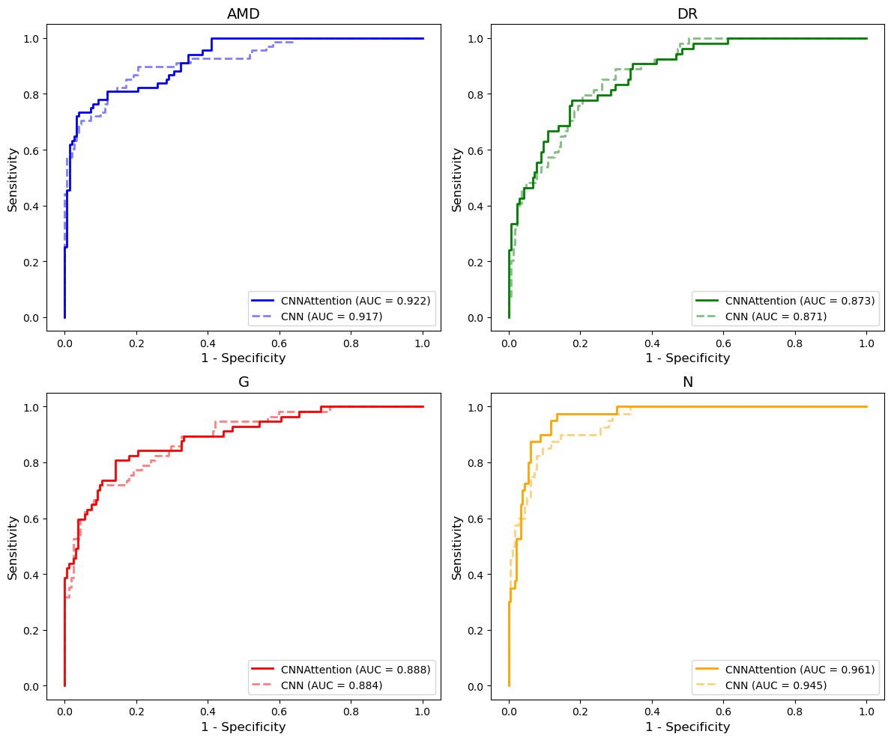
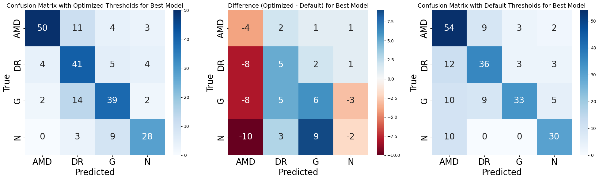
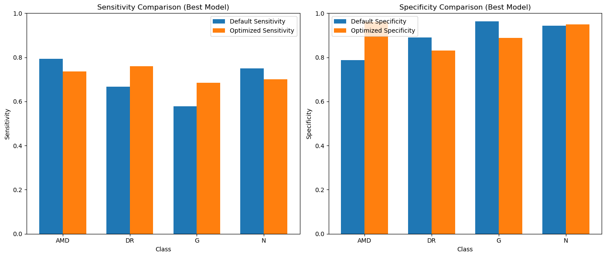
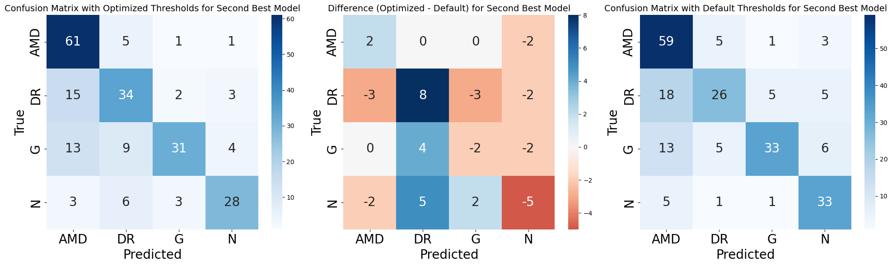
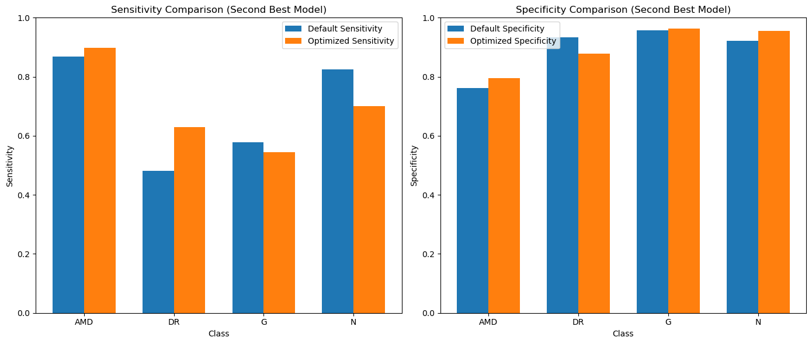
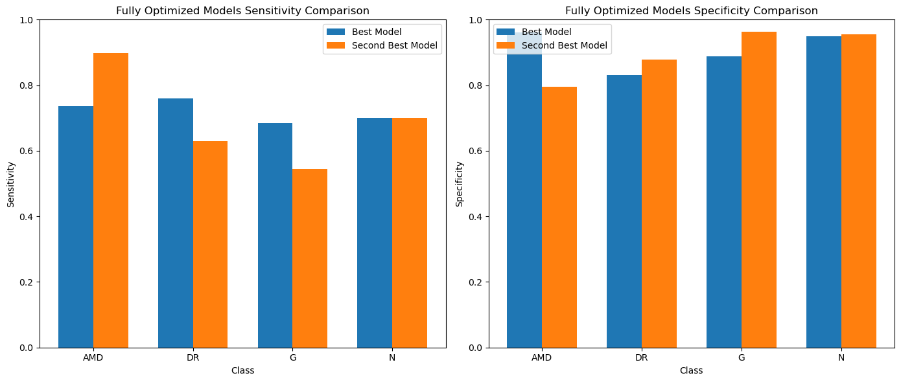

# Retinal Image Visual Classifier

This project implements a CNN-based visual classifier for retinal images, focusing on identifying various conditions like Age-Related Macular Degeneration (AMD), Diabetic Retinopathy (DR), and Glaucoma. The model has been optimized through hyperparameter tuning and enhanced with attention mechanisms like CBAM and Transformer.

## Table of Contents
- [Introduction](#introduction)
- [Project Goals](#project-goals)
- [Dataset](#dataset)
- [Model Architecture](#model-architecture)
- [Hyperparameter Tuning](#hyperparameter-tuning)
- [Performance](#performance)
- [Threshold Optimization](#threshold-optimization)
- [References](#references)

## Introduction
This project was carried out by Waqaas Akmal Butt, a Research Assistant at the He Lab, University of Chicago. The focus is on developing and optimizing CNN-based models for retinal image classification, leveraging attention mechanisms to enhance the performance of the classifier.

## Project Goals
1. Determine the best hyperparameters for the CNN visual classifier.
2. Augment the CNN with attention mechanisms (CBAM and Transformer).
3. Compare performance between the CNN and attention-enhanced models.
4. Optimize the sensitivity and specificity values for a fully refined classifier.

## Dataset
The project uses two main datasets:
- FIVES dataset
- VietAI competition dataset

### Classes
The classifier predicts one of the following four classes:
1. Age-Related Macular Degeneration (AMD)
2. Diabetic Retinopathy (DR)
3. Glaucoma (G)
4. Normal (N)

### Preprocessing
- Standard zoom/masking techniques were applied.
- Multi-class images were removed.
- Images were resized to 256x256 pixels.

### Data Split
- **Train:** 1531 images
- **Validation:** 438 images
- **Test:** 219 images

| Class | Train | Validation | Test | Total |
|-------|-------|------------|------|-------|
| AMD   | 477   | 137        | 68   | 682   |
| DR    | 379   | 109        | 54   | 542   |
| G     | 396   | 113        | 57   | 566   |
| N     | 279   | 79         | 40   | 398   |
| **Total** | **1531** | **438** | **219** | **2188** |

## Model Architecture
The CNN model was augmented with two types of attention mechanisms:
1. CNN + CBAM (Convolutional Block Attention Module)
2. CNN + Transformer

The images were transformed using techniques like `RandomHorizontalFlip`, `RandomRotation(30)`, and normalized using ImageNet standards.

## Hyperparameter Tuning
The CNN was tuned for the following parameters:
- Layers: [3, 5]
- Filters: [32, 64]
- Kernels: [3, 5, 7]

### Best Model (CNN)
- **Layers:** 5
- **Filters:** 64
- **Kernel size:** 5
- **AUC (ROC):** 0.9150
- **AUC (PR):** 0.8236

## Performance
### Comparison with Attention Hybrids

- Best model based on ROC AUC: **CNNAttention (AUC = 0.913)**
- Second-best model based on ROC AUC: **CNN (AUC = 0.902)**
- Best model based on PR AUC: **CNNAttention (AUC = 0.818)**
- Second-best model based on PR AUC: **CNN (AUC = 0.796)**

### Classwise Sensitivity / 1-Specificity (Comparison)

Results were computed per class, with sensitivity and specificity metrics for the best-performing CNN and the attention-enhanced model.

## Threshold Optimization
Thresholds for the best-performing models were optimized using Youden’s Index:

| Class | Best Model (CNNAttention) | Second Best Model (CNN) |
|-------|---------------------------|-------------------------|
| AMD   | 0.5906                    | 0.2559                  |
| DR    | 0.3196                    | 0.0522                  |
| G     | 0.1727                    | 0.1967                  |
| N     | 0.1585                    | 0.3515                  |

<small>Table with optimized thresholds for each class in both models.</small>

<small>Confusion matrix for the best model (CNNAttention) with optimized thresholds.</small>

<small>Bar chart showing the improvement in sensitivity and specificity for the best model (CNNAttention) after threshold optimization.</small>

<small>Confusion matrix for the second-best model (CNN) with optimized thresholds.</small>

<small>Bar chart showing the improvement in sensitivity and specificity for the second-best model (CNN) after threshold optimization.</small>

<small>Comparison of sensitivity and specificity values for the best and second-best models after threshold optimization.</small>

## References
FIVES dataset: [https://figshare.com/articles/figure/FIVES_A_Fundus_Image_Dataset_for_AI-based_Vessel_Segmentation/19688169?file=34969398](https://figshare.com/articles/figure/FIVES_A_Fundus_Image_Dataset_for_AI-based_Vessel_Segmentation/19688169?file=34969398)

VietAI dataset: [https://www.kaggle.com/competitions/vietai-advance-retinal-disease-detection-2020/data](https://www.kaggle.com/competitions/vietai-advance-retinal-disease-detection-2020/data)
